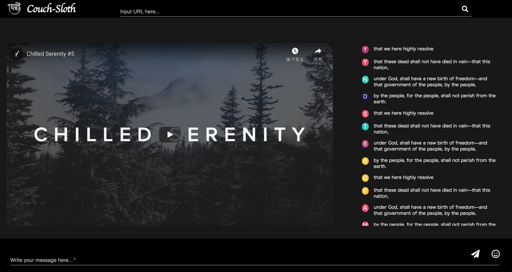

Couch Sloth
===

What is Couch Sloth
---

**Couch Sloth** is application which someone watch youtube with friend during chatting.

Screenshot
---




Structure
---

```
|--client-react
|  |--public
|  |  |--index.html
|  |--src
|  |  |--App.css
|  |  |--App.js
|  |  |--components
|  |  |  |--Chats.js
|  |  |  |--Header.js
|  |  |  |--LoginModal.js
|  |  |  |--Messages.js
|  |  |  |--Player.js
|  |  |  |--WebSocket.js
|  |  |--img
|  |  |  |--bg-movie.png
|  |  |  |--sloth.png
|  |  |--index.css
|  |  |--index.js
|  |  |--pages
|  |  |  |--Index.js
|--server
|  |--build.gradle
|  |--src
|  |  |--main
|  |  |  |--Application.kt
|  |  |  |--controllers
|  |  |  |  |--ApiController.kt
|  |  |--test
|  |  |  |--controllers
|  |  |  |  |----ApiControllerKtTest.kt
```

### client

- React
- Asynchronous Operation Youtube
- Asynchronous Chatting

### server

- WebSocket
- [Ktor: Build Asynchronous Servers and Clients in Kotlin \| Ktor Framework](https://ktor.io/)

Usage
---

WebSocket Endpoint
---

| Endpoint  | describe  | parameter |
|---|---|---|
| `/say`  | Massage send websocket | {userName: String, messages: String} |
| `/video/play`  | Play youtube | {isPlay: Boolean, progress: double} |
| `/video/pause`  | Pause youtube | {isPlay: Boolean, progress: double} |
| `/video/url`  | Set youtube URL | {url: String} |


Contributing
---

- Nico
- Yuki
- Yasu

Reference
---

- [JavaFX Documentation Project](https://fxdocs.github.io/docs/)
- [RobertLemmens/youtube\-sync: Watch youtube together](https://github.com/RobertLemmens/youtube-sync)
- [DomHeal/JavaFX\-Chat: JavaFX Socket Multithreaded Chat Client / Server \- FXML](https://github.com/DomHeal/JavaFX-Chat)
- [akullpp/awesome\-java: A curated list of awesome frameworks, libraries and software for the Java programming language\.](https://github.com/akullpp/awesome-java)
- [mhrimaz/AwesomeJavaFX: A curated list of awesome JavaFX libraries, books, frameworks, etc\.\.\.](https://github.com/mhrimaz/AwesomeJavaFX)
- [Quick Start—Ktor 1\.4\.0](https://ktor.io/docs/quickstart-index.html)
- [javaFX\-multiple\-controllers\-tutorial](https://github.com/mvpjava/javaFX-multiple-controllers-tutorial)
- [Material\-UI: A popular React UI framework](https://material-ui.com/)
- [react\-modal documentation](http://reactcommunity.org/react-modal/)
- [brambo48/react\-youtube\-sync: Play youtube videos on multiple computers / devices in perfect sync\. Built with React, Redux & Socket\.IO](https://github.com/brambo48/react-youtube-sync)
- [cookpete/react\-player: A React component for playing a variety of URLs, including file paths, YouTube, Facebook, Twitch, SoundCloud, Streamable, Vimeo, Wistia and DailyMotion](https://github.com/CookPete/react-player)
- [Larkenx/ktor\-react\-chat: A real\-time chat client\+server created using web sockets with Kotlin\+Ktor backend and React\+Material UI front end\.](https://github.com/Larkenx/ktor-react-chat)
